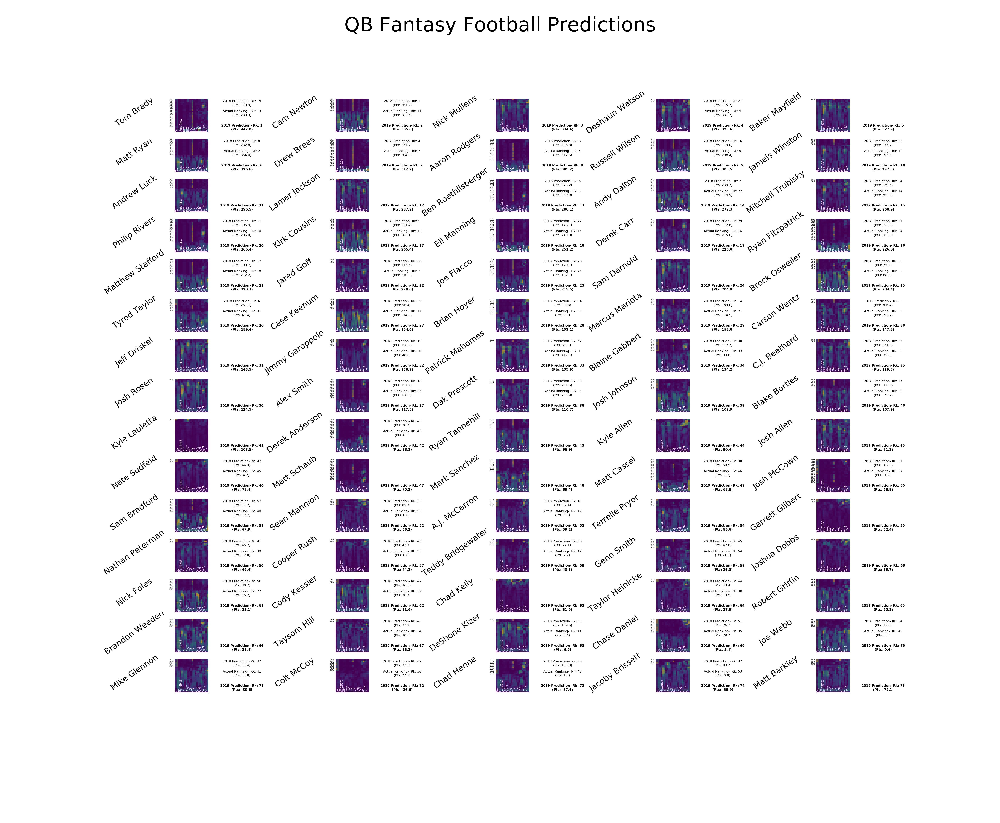

<link href="style.css" rel="stylesheet"></link>

# Fantasy Football Neural Network
#### Created by Adiel Felsen

## Description
This neural network predicts [fantasy football](https://en.wikipedia.org/wiki/Fantasy_football_(American) scores (standard scoring) for the quarterback (QB), running back (RB), wide receiver (WR) and tight end (TE) positions.

## Resources
* This program uses [keras](https://keras.io/) to constuct the neural network
* [numpy](https://www.numpy.org/), [scipy](https://www.scipy.org/) and [pandas](https://pandas.pydata.org/) are used to structure the data
* [matplotlib](https://matplotlib.org/) is used to plot the results
* All data is sourced from [Pro Football Reference](https://www.pro-football-reference.com/)

## Neural Network Training

#### Training Data ####

The training data is the statistics of each NFL player (in the relevant position) from 1980 to 2016 and is sourced from pro-football-reference.com
* These statistics include: Rank (Since 1980), Year, Age, Games Played, Games Started, FantPt (standard), FantPt (PPR), FantPt/G (standard), FantPt/G (PPR), Cmp, P-Att, P-Yds, P-TD, Int, Ru-Att, Ru-Yds, Ru-TD, Rec, Rec-Yds, Rec-TD, Fmb)
* Each player's career statistics are divided to generate more training data
  * For example, if a player played from 1990 - 1992, his statistics would be represented as three data points: 1990, 1990-1991 and 1990-1992
* Each data point is padded with zeros to make its shape (22,22)

#### Structure and Training ####

All positions are trained with the same sequential network structure:
* Two convolutional layers (filters = 22 and 10 respectively)
* A flatten layer
* Two dense layers (filters = 64 and 1 respectively)

For the current models (in Models folder) the epochs vary, to account for different training data sizes:
* QB position is trained for 300 epochs
* TE position is trained for 200 epochs
* WR and RB positions are trained for 150 epochs

## Neural Network Testing and Predictions

The neural network is tested with 2017 player data and 2018 labels. The results for each model is as follows:
* QB Model

   * Average Ranking Difference: 10.814814814814815
   * Median Ranking Difference: 7.5
   * Average Score Difference: 75.32401837596187
   * Median Score Difference: 60.54140167236329

* RB Model
   * Average Ranking Difference: 25.81896551724138
   * Median Ranking Difference: 22.5
   * Average Score Difference: 51.20686644408209
   * Median Score Difference: 39.091397857666024

* WR Model
   * Average Ranking Difference: 28.589147286821706
   * Median Ranking Difference: 24.0
   * Average Score Difference: 43.87782199133274
   * Median Score Difference: 34.15196533203125

* TE Model
  * Average Ranking Difference: 17.82278481012658
  * Median Ranking Difference: 13.0
  * Average Score Difference: 27.06946094292629
  * Median Score Difference: 17.481335449218747

Predictions are based on 2018 data. Predictions do not include any players who were not in the NFL in 2017.

* QB Model

| 1. Tom Brady: 447.78 |2. Cam Newton: 385.05 |3. Deshaun Watson: 328.59 |4. Matt Ryan: 326.57 |5. Drew Brees: 312.18 |
|---|
| 6. Aaron Rodgers: 305.21 |7. Russell Wilson: 303.53 |8. Jameis Winston: 297.53 |9. Ben Roethlisberger: 286.06 |10. Andy Dalton: 279.34 |
| 11. Mitchell Trubisky: 268.95 |12. Philip Rivers: 266.37 |13. Kirk Cousins: 265.39 |14. Eli Manning: 251.18 |15. Derek Carr: 225.97 |
| 16. Ryan Fitzpatrick: 225.95 |17. Matthew Stafford: 220.65 |18. Jared Goff: 220.65 |19. Joe Flacco: 215.46 |20. Brock Osweiler: 204.42 |
| 21. Tyrod Taylor: 159.44 |22. Case Keenum: 154.57 |23. Brian Hoyer: 153.11 |24. Marcus Mariota: 152.78 |25. Carson Wentz: 147.46 |
| 26. Jimmy Garoppolo: 138.88 |27. Patrick Mahomes: 135.86 |28. Blaine Gabbert: 134.16 |29. C.J. Beathard: 129.49 |30. Alex Smith: 117.52 |
| 31. Dak Prescott: 116.75 |32. Blake Bortles: 107.95 |33. Derek Anderson: 98.12 |34. Nate Sudfeld: 78.41 |35. Matt Cassel: 68.92 |
| 36. Josh McCown: 68.91 |37. Sam Bradford: 67.89 |38. Sean Mannion: 66.23 |39. A.J. McCarron: 59.18 |40. Nathan Peterman: 49.4 |
| 41. Cooper Rush: 44.06 |42. Teddy Bridgewater: 43.81 |43. Geno Smith: 36.79 |44. Nick Foles: 33.11 |45. Cody Kessler: 31.61 |
| 46. Taylor Heinicke: 27.85 |47. Taysom Hill: 18.09 |48. DeShone Kizer: 6.63 |49. Chase Daniel: 5.38 |50. Joe Webb: 0.38 |
| 51. Mike Glennon: -30.57 |52. Colt McCoy: -36.59 |53. Chad Henne: -37.36 |54. Jacoby Brissett: -59.87 | |

* RB Model

| 1. Frank Gore: 431.41 |2. Melvin Gordon: 349.33 |3. James Conner: 345.88 |4. Alvin Kamara: 239.34 |5. Todd Gurley: 225.7 |
|---|
| 6. Ezekiel Elliott: 214.83 |7. Kareem Hunt: 205.62 |8. James White: 204.63 |9. Mark Ingram: 192.95 |10. Leonard Fournette: 190.35 |
| 11. Tevin Coleman: 189.85 |12. Joe Mixon: 188.47 |13. Marlon Mack: 181.27 |14. David Johnson: 178.81 |15. Devonta Freeman: 165.32 |
| 16. Jay Ajayi: 161.0 |17. Tarik Cohen: 160.99 |18. Jordan Howard: 160.74 |19. T.J. Yeldon: 159.01 |20. Aaron Jones: 157.87 |
| 21. Matt Breida: 155.04 |22. Chris Thompson: 150.89 |23. Giovani Bernard: 149.76 |24. Doug Martin: 148.28 |25. Christian McCaffrey: 146.48 |
| 26. Alex Collins: 139.45 |27. Lamar Miller: 130.19 |28. LeGarrette Blount: 129.74 |29. Theo Riddick: 128.53 |30. Jamaal Williams: 128.25 |
| 31. Isaiah Crowell: 124.76 |32. Peyton Barber: 123.08 |33. C.J. Anderson: 121.02 |34. Duke Johnson: 113.21 |35. Jalen Richard: 111.19 |
| 36. Latavius Murray: 110.46 |37. Chris Ivory: 106.39 |38. Carlos Hyde: 98.43 |39. Alfred Morris: 93.66 |40. Kenyan Drake: 90.66 |
| 41. Austin Ekeler: 87.96 |42. Jeremy Hill: 87.2 |43. Benny Cunningham: 79.26 |44. LeSean McCoy: 76.71 |45. Samaje Perine: 75.61 |
| 46. Bilal Powell: 73.55 |47. Mike Gillislee: 72.05 |48. Ameer Abdullah: 69.01 |49. Dalvin Cook: 69.0 |50. Dion Lewis: 68.41 |
| 51. Chris Carson: 67.85 |52. Derrick Henry: 65.21 |53. Malcolm Brown: 62.96 |54. Corey Grant: 59.75 |55. Kyle Juszczyk: 59.58 |
| 56. Jonathan Stewart: 58.87 |57. Charcandrick West: 58.7 |58. Alfred Blue: 58.1 |59. Corey Clement: 56.77 |60. Brandon Bolden: 51.97 |
| 61. Marshawn Lynch: 50.23 |62. Wayne Gallman: 50.01 |63. Jamaal Charles: 47.56 |64. David Fluellen: 47.27 |65. Devontae Booker: 44.81 |
| 66. Adrian Peterson: 44.35 |67. Brian Hill: 43.96 |68. Andy Janovich: 40.93 |69. Justin Davis: 38.11 |70. Taquan Mizzell: 37.71 |
| 71. Elijah McGuire: 35.08 |72. Wendell Smallwood: 33.51 |73. Derrick Coleman: 30.48 |74. Senorise Perry: 29.28 |75. Derek Watt: 28.47 |
| 76. Mike Davis: 28.08 |77. Tre Madden: 26.44 |78. Robert Turbin: 26.33 |79. Javorius Allen: 25.9 |80. Keith Smith: 24.76 |
| 81. Zach Zenner: 24.46 |82. Danny Vitale: 24.17 |83. Dwayne Washington: 23.88 |84. Damien Williams: 23.67 |85. C.J. Ham: 22.82 |
| 86. Rod Smith: 21.95 |87. Travaris Cadet: 21.67 |88. Zach Line: 20.56 |89. Elijhaa Penny: 20.06 |90. Byron Marshall: 19.49 |
| 91. Patrick DiMarco: 18.96 |92. Alex Armah: 13.31 |93. Jeremy McNichols: 12.38 |94. C.J. Prosise: 11.58 |95. Matthew Dayes: 9.52 |
| 96. Michael Burton: 8.65 |97. Anthony Sherman: 8.5 |98. Jacquizz Rodgers: 8.32 |99. Tyler Ervin: 7.92 |100. Tommy Bohanon: 7.79 |
| 101. Trey Edmunds: 5.49 |102. Kenjon Barner: 5.32 |103. DeAndre Washington: 3.55 |104. Jamize Olawale: 3.16 |105. De'Angelo Henderson: 2.7 |
| 106. Roosevelt Nix: 2.35 |107. Marcus Murphy: -1.94 |108. Dare Ogunbowale: -2.83 |109. Shane Smith: -4.98 |110. Raheem Mostert: -7.03 |
| 111. Cameron Artis-Payne: -9.86 |112. Kapri Bibbs: -12.94 |113. James Develin: -29.35 |114. Robert Kelley: -71.78 |115. D'Onta Foreman: -76.59 |
| 116. Thomas Rawls: -116.46 | | | | |

* WR Model

| 1. Antonio Brown: 230.29 |2. JuJu Smith-Schuster: 223.48 |3. Michael Thomas: 191.48 |4. Keenan Allen: 172.18 |5. Davante Adams: 172.18 |
|---|
| 6. Kenny Golladay: 168.43 |7. Adam Thielen: 166.6 |8. Mohamed Sanu: 163.02 |9. Amari Cooper: 161.8 |10. Robert Woods: 160.23 |
| 11. Doug Baldwin: 147.07 |12. Chris Godwin: 145.35 |13. Justin Hardy: 142.18 |14. A.J. Green: 141.43 |15. DeAndre Hopkins: 141.22 |
| 16. Demaryius Thomas: 140.11 |17. Tyreek Hill: 139.01 |18. Sterling Shepard: 137.52 |19. Trent Taylor: 133.88 |20. Seth Roberts: 133.63 |
| 21. Cooper Kupp: 132.43 |22. Pierre Garcon: 132.13 |23. Sammy Watkins: 130.42 |24. Tyrell Williams: 128.55 |25. Ryan Switzer: 128.43 |
| 26. Jordy Nelson: 127.14 |27. Willie Snead: 124.96 |28. Brandin Cooks: 124.82 |29. Adam Humphries: 123.07 |30. Stefon Diggs: 122.51 |
| 31. Larry Fitzgerald: 114.39 |32. Jarvis Landry: 114.27 |33. Robby Anderson: 109.17 |34. Chester Rogers: 108.78 |35. DeSean Jackson: 107.55 |
| 36. Emmanuel Sanders: 107.09 |37. Allen Robinson: 105.66 |38. T.Y. Hilton: 105.19 |39. Mike Evans: 103.14 |40. Keelan Cole: 102.27 |
| 41. Michael Floyd: 100.42 |42. David Moore: 98.47 |43. Julio Jones: 98.07 |44. Alshon Jeffery: 97.39 |45. Allen Hurns: 94.13 |
| 46. Torrey Smith: 92.2 |47. Jamison Crowder: 91.0 |48. Jordan Matthews: 90.08 |49. Corey Davis: 88.87 |50. Chris Moore: 86.89 |
| 51. Eli Rogers: 85.89 |52. Zay Jones: 85.83 |53. Jermaine Kearse: 84.15 |54. Dontrelle Inman: 83.22 |55. Corey Coleman: 82.74 |
| 56. Mike Wallace: 82.51 |57. Taylor Gabriel: 81.48 |58. Aldrick Robinson: 81.43 |59. Devin Funchess: 80.96 |60. Michael Crabtree: 79.26 |
| 61. Kenny Stills: 78.45 |62. Randall Cobb: 78.43 |63. Terrance Williams: 78.05 |64. Tyler Lockett: 75.13 |65. Jakeem Grant: 75.04 |
| 66. Mike Williams: 74.8 |67. Jarius Wright: 74.79 |68. Curtis Samuel: 74.52 |69. Kendrick Bourne: 74.35 |70. Rashard Higgins: 73.78 |
| 71. Nelson Agholor: 73.28 |72. Tyler Boyd: 70.82 |73. Josh Malone: 70.43 |74. Phillip Dorsett: 68.13 |75. Bennie Fowler: 67.27 |
| 76. Josh Reynolds: 66.56 |77. Travis Benjamin: 65.77 |78. Brice Butler: 64.26 |79. Marvin Hall: 60.84 |80. Danny Amendola: 60.7 |
| 81. Markus Wheaton: 60.11 |82. Ryan Grant: 59.59 |83. Josh Bellamy: 58.64 |84. Martavis Bryant: 58.3 |85. Cordarrelle Patterson: 57.09 |
| 86. Jehu Chesson: 56.27 |87. Russell Shepard: 55.53 |88. John Brown: 55.34 |89. T.J. Jones: 52.64 |90. Chris Hogan: 51.46 |
| 91. Donte Moncrief: 51.23 |92. Sammie Coates: 49.66 |93. Andre Roberts: 49.26 |94. Leonte Carroo: 48.21 |95. Taywan Taylor: 46.91 |
| 96. Nick Williams: 46.9 |97. Marvin Jones: 45.49 |98. Damiere Byrd: 42.53 |99. Jaron Brown: 41.57 |100. Darrius Heyward-Bey: 40.63 |
| 101. Andy Jones: 40.59 |102. Kevin White: 38.9 |103. Austin Carr: 36.71 |104. Demarcus Robinson: 36.11 |105. DeVante Parker: 33.81 |
| 106. Pharoh Cooper: 32.65 |107. Geremy Davis: 32.58 |108. Josh Doctson: 32.45 |109. Cole Beasley: 29.67 |110. Mike Thomas: 29.35 |
| 111. Trevor Davis: 28.76 |112. Charone Peake: 27.76 |113. Noah Brown: 27.36 |114. Marquise Goodwin: 26.48 |115. Johnny Holton: 25.92 |
| 116. Alex Erickson: 25.33 |117. Tanner McEvoy: 24.71 |118. Andre Holmes: 24.07 |119. John Ross: 21.21 |120. Cody Core: 20.59 |
| 121. JJ Nelson: 10.22 |122. Victor Bolden: 7.77 |123. Mose Frazier: 6.45 |124. Laquon Treadwell: -1.28 |125. Marcus Kemp: -4.86 |
| 126. Bradley Marquez: -6.03 |127. Breshad Perriman: -14.01 |128. Matthew Slater: -15.92 |129. Brandon Tate: -20.0 | |

* TE Model

| 1. George Kittle: 141.81 |2. Rob Gronkowski: 131.5 |3. Eric Ebron: 117.61 |4. Zach Ertz: 104.06 |5. Delanie Walker: 95.39 |
|---|
| 6. Antonio Gates: 92.47 |7. David Njoku: 91.76 |8. Evan Engram: 90.53 |9. Charles Clay: 90.2 |10. O.J. Howard: 86.08 |
| 11. Austin Hooper: 85.37 |12. Josh Hill: 70.21 |13. Blake Jarwin: 64.46 |14. Kyle Rudolph: 64.34 |15. Cameron Brate: 63.61 |
| 16. Ben Watson: 63.3 |17. C.J. Uzomah: 60.93 |18. Jimmy Graham: 60.76 |19. Travis Kelce: 54.99 |20. Gerald Everett: 51.21 |
| 21. Vernon Davis: 50.85 |22. Jesse James: 49.63 |23. Geoff Swaim: 42.51 |24. Matt LaCosse: 42.23 |25. Nick Boyle: 41.73 |
| 26. Jeff Heuerman: 40.82 |27. Trey Burton: 40.28 |28. Daniel Brown: 40.03 |29. Jared Cook: 37.07 |30. Nick Vannett: 36.14 |
| 31. Dwayne Allen: 34.28 |32. Demetrius Harris: 33.94 |33. Jonnu Smith: 33.68 |34. James O'Shaughnessy: 33.39 |35. Ricky Seals-Jones: 32.24 |
| 36. Nick O'Leary: 31.66 |37. Rhett Ellison: 31.22 |38. Darren Fells: 29.57 |39. Logan Thomas: 29.49 |40. Luke Willson: 28.25 |
| 41. Tyler Higbee: 27.96 |42. Seth Devalve: 26.38 |43. Derek Carrier: 25.76 |44. Garrett Celek: 25.09 |45. Jermaine Gresham: 24.76 |
| 46. Marcedes Lewis: 22.54 |47. Eric Tomlinson: 22.27 |48. Ed Dickson: 21.94 |49. Levine Toilolo: 20.75 |50. Blake Bell: 19.47 |
| 51. Jeremy Sprinkle: 19.01 |52. David Morgan: 18.71 |53. Maxx Williams: 18.6 |54. Hunter Henry: 18.35 |55. Lance Kendricks: 17.38 |
| 56. Luke Stocker: 15.6 |57. Xavier Grimble: 15.35 |58. Ben Braunecker: 15.05 |59. MyCole Pruitt: 14.7 |60. Vance McDonald: 14.47 |
| 61. Dion Sims: 14.35 |62. John Phillips: 13.18 |63. Sean Culkin: 11.32 |64. Garrett Griffin: 9.38 |65. Lee Smith: 8.85 |
| 66. Gabe Holmes: 8.73 |67. Eric Saubert: 7.87 |68. Darrell Daniels: 7.17 |69. Chris Manhertz: 6.54 |70. Khari Lee: 6.27 |
| 71. Logan Paulsen: 5.59 |72. Johnny Mundt: 4.56 |73. Virgil Green: 3.69 |74. Matt Lengel: 1.6 |75. Clark Harris: 0.68 |
| 76. Hakeem Valles: 0.41 |77. Clive Walford: -1.67 |78. Michael Roberts: -2.24 |79. Tyrone Swoopes: -14.31 | |

## Explanation of Visualizations
The players are organized in order of their 2019 ranking.
* Name of player is on the left
* The image in the center is a saliency visualization of the input matrix generated by Keras
    * Years are labeled on the left side, column labels are on the bottom
    * Unlabeled rows/columns are empty (filler) to make each matrix the same size
* The 2018 Prediction, 2018 Actual Scores and 2019 prediction are on the right

## How to train a model:
In main:
* Change position variable to train for different positions

In FantasyScoreNN:
* Add an "and 0" to the line "if(os.path.isfile(self.cLOADBOTPATH))" to allow for retraining of a model
* Alter the model structure or epochs to try to improve results

## Visualization Examples

